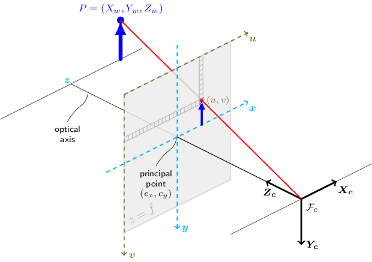

# Stereo Camera Calibration

This is a simple stereo camera calibration tool that uses OpenCV to calibrate a stereo camera. The tool is written in Python and uses the OpenCV library to perform the calibration. The tool is designed to be easy to use and requires only a few lines of code to calibrate a stereo camera.



## Steps For Stereo Calibration and Rectification

Camera calibration is the process of determining the intrinsic and extrinsic parameters of a stereo camera. 
This process is essential to eliminate the lens distortion. Stereo rectification is the process of transforming
the images captured by the stereo camera so that the epipolar lines are parallel to the image plane. This process
is essential for stereo matching algorithms to work correctly. The steps for stereo calibration and rectification are as follows:

* Calibrate individual cameras using the standard OpenCV calibration method 
* Determine the transformation between the two cameras used in the stereo camera setup.
* Using the parameters obtained in the previous steps and the stereoCalibrate method, we determine the transformations applied to both the images for stereo rectification.
* Finally, a mapping required to find the undistorted and rectified stereo image pair is obtained using the initUndistortRectifyMap method.
* This mapping is applied to the original images to get a rectified undistorted stereo image pair.

## Installation

To install the tool, it is recommended to use a virtual environment. You can create a virtual environment using the following command:

```bash
conda create -n stereo_calibration python=3.8
```

Once you have created the virtual environment, you can activate it using the following command:

```bash
conda activate stereo_calibration
```

After activating the virtual environment, you can install the required dependencies using the following command:

```bash
pip install -r requirements.txt
```

Once you have installed the dependencies, you can run the tool using the following command:

```bash
python src/main.py --input_path data --checkboard_size 11,7 --square_size 0.003
```

## Usage

To use the tool, you need to provide the paths to the calibration images for the left and right cameras. The calibration images should be in a folder with the following structure:

```
data 
│ 
└───images
    └─── left
    │    │   left_01.jpg
    │    │   left_02.jpg
    │    │   ...
    │    |   left_n.jpg
    └─── right
    |    │   right_01.jpg
    |    │   right_02.jpg
    |    │   ...
    |    |   right_n.jpg
```

Feel free to use the provided calibration images in the `data` folder. To calibrate the stereo camera, you can use the following code:

```python
from stereo_calibration import StereoCalibration

# Paths to the calibration images
input_path = "data"
checkboard_size = (9, 6)
square_size = 0.025

# Create a stereo calibration object
stereo_calibration = StereoCalibration(input_path, checkboard_size, square_size)

# Create the chessboard points
stereo_calibrator.create_chessboard_points()

# Calibrate the stereo camera
stereo_calibrator.calibrate()

# Save the stereo calibration
stereo_calibrator.save_stereo_calibration()

# Optionally, rectify the calibration images
stereo_calibrator.rectify_calibration_images()
```

The tool will output the calibration parameters for the stereo camera, as well as the rectified calibration images. You can use these parameters to rectify the images captured by the stereo camera.
The structure of the input folder should be as follows:

```
data/
├── corners
│   ├── left
│   │   ├── Im_L_1.png
│   │   ├── Im_L_2.png
|   |   ├── ...
│   │   └── Im_L_20.png
│   └── right
│       ├── Im_R_1.png
│       ├── Im_R_2.png
|       ├── ...
│       └── Im_R_20.png
├── images
│   ├── left
│   │   ├── Im_L_1.png
│   │   ├── Im_L_2.png
|   |   ├── ...
│   │   └── Im_L_20.png
│   └── right
│       ├── Im_R_1.png
│       ├── Im_R_2.png
|       ├── ...
│       └── Im_R_20.png
├── params
│   └── stereo_calibration.xml
└── rectified
    ├── left
    │   ├── Im_L_1.png
    │   ├── Im_L_2.png
    |   ├── ...
    │   └── Im_L_20.png
    └── right
        ├── Im_R_1.png
        ├── Im_R_2.png
        ├── ...
        └── Im_R_20.png
```

## Data

The calibration images used in this project were taken from Kaggle dataset [Chessboard Pictures for Stereocamera Calibration](https://www.kaggle.com/datasets/danielwe14/stereocamera-chessboard-pictures/data). The dataset contains 20 pairs of images of a chessboard pattern taken with a stereo camera. The images are used to calibrate the stereo camera and estimate the intrinsic and extrinsic parameters of the camera.

## References

- [OpenCV](https://opencv.org/)
- [Camera Calibration using OpenCV](https://docs.opencv.org/4.x/dc/dbb/tutorial_py_calibration.html)


## License

This project is licensed under the MIT License - see the [LICENSE](LICENSE) file for details.